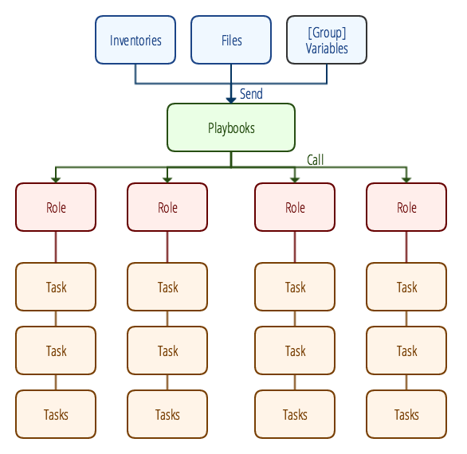

Infrastructure as a code with Ansible + Docker
==========================================================
This repository is the skeleton to do infrastructure as a code with Ansible + Docker. Assume that you already have understanding of Ansible and Docker you can continue with the following:

- Ansible is use to run automated tasks from host preparation to service deployment.
- Docker is use to contain services which will get deployed by Ansible.
- Combining two of above together created infrastructure as a code, which is a way to do and maintain infrastructure with codes that is easier to maintain and understand.


Requirements
----------------------------------------------------------
- Docker 1.10 or above.
- Docker machine 0.7.0 or above.
- Ansible 2.1 (with patch) or above.
- Able to SSH to host.

Let's get started
----------------------------------------------------------
- [Getting Started: The start line](docs/tutorials/01_getting_started.md)
- [Inventories, Files, Variables]()

How does this Ansible work
----------------------------------------------------------
### Playbooks and Roles
Let's talk about roles first. Roles are what Ansible will call when specific playbook is run, which inside the role contain tasks to execute. One playbook will run one role with pre and post tasks.

### Design
This Ansible is designed to have four main roles to do four main tasks. Basically explained in four steps with

- Prepare remote host to be ready for deployment.
- Install docker on remote host (required for Ansible-Docker)
- Setup docker machine on remote host (required for Ansible-Docker to be able to remotely manage docker on remote host)
- Deploy Services on remote host with Ansible-Docker

Four of which already transformed into playbooks, for in-depth information please navigate to each galaxy role's page.

- [Host Preparation.](https://galaxy.ansible.com/winggundamth/host_preparation/)
- [Install Docker.](https://galaxy.ansible.com/winggundamth/install_docker/)
- [Manage docker machine.](https://galaxy.ansible.com/winggundamth/docker_machine/)
- [Automated Docker.](https://galaxy.ansible.com/winggundamth/automated_docker/)

### Usage
Usage is simple like other Ansible playbook, just run a playbook you need with required variables
```
# Example of running host-preparation
# -i define inventory path -e define a variable for playbook
ansible-playbook -i inventories/target_hosts -e host_preparation_host_name=service host-preparation.yml
```

Structure
==========================================================


Structure is set with 3 tiers:

- **External tier:** Included Inventories, Files, and Variables. Playbook with read from this tier for target remote host(s), required files for service, and required variables.
- **Playbook tier:** Each playbook will call a role after downloading it from Ansible Galaxy.
- **Role tier:** Each ansible role will have tasks of their own which needed to perform to complete designated task.

FAQ
----------------------------------------------------------
###Variable priority
According to [Variable Precedence: Where Should I Put A Variable?](http://docs.ansible.com/ansible/playbooks_variables.html#variable-precedence-where-should-i-put-a-variable). TL;DR 'The last listed variables win'.
Order of variable priority would be:

- roles/*/default/main.yml
- group_vars/all
- group\_vars/group_name
- host_vars/all
- host\_vars/group_name
- vars/\*.yml (as specific vars_file in inventory file)
- extra vars with -e with `ansible-playbook` command

So from above priority. In use case you want to specific something like the memory of elastic search and will be difference on each cluster. You should create default allocate memory variable in `group_vars/all` file and specific memory for each cluster in `group_vars/group_name`. Don't forget to change group_name file name to your group name. And don't forget to remove or comment that variable in `vars/*.yml` since it will overwrite and win the priority.

License
----------------------------------------------------------
The MIT License (MIT)
